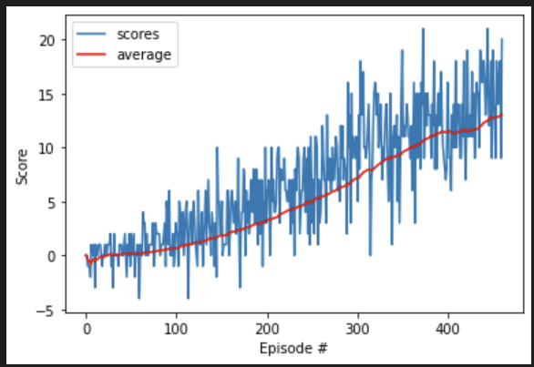

# Banana Collecting Agent
## 1. Project's goal

In this project, **the goal is to train an agent to navigate a virtual world and collect as many yellow bananas as possible while avoiding blue bananas**

## 2. Agent Learning Algorithm

### Software environment

Since the course was recorded five years ago, many software versions have changed, so it was difficult for me to reproduce with the software environment at that time. Fortunately, I overcame these difficulties and finally completed the training agent successfully.  I encountered the following problems:

- Old unityagents package version change
- Torch that older versions are no longer supported install in pip
- Some function parameters change and are incompatible

I solve all the above problems.

### Algorithm

This project implements a *Value Based* method called Deep Q-Networks. 

Deep Q Learning combines 2 approaches :

- A Reinforcement Learning method called Q Learning (aka SARSA max)
- A Deep Neural Network to learn a Q-table approximation (action-values) and use RELU build a network that maps state to action values
- Experience Replay, fixed-size buffer to store experience
- Fixed Q Targets

## 3. Plot of Rewards
The training results are as follows:
Episode 100	Average Score: 0.64
Episode 200	Average Score: 3.19
Episode 300	Average Score: 7.16
Episode 400	Average Score: 11.44
Episode 460	Average Score: 13.03
Environment solved in 360 episodes!	Average Score: 13.03

## 4. Ideas for Future Work

It can be seen there seam to be some cases where the agent learned that it could repeat two operations multiple times. Here some possible future work to make this agent play the banana game even better could be the following.

1. Double Deep Q-Learning
2. The Dueling Network Architecture